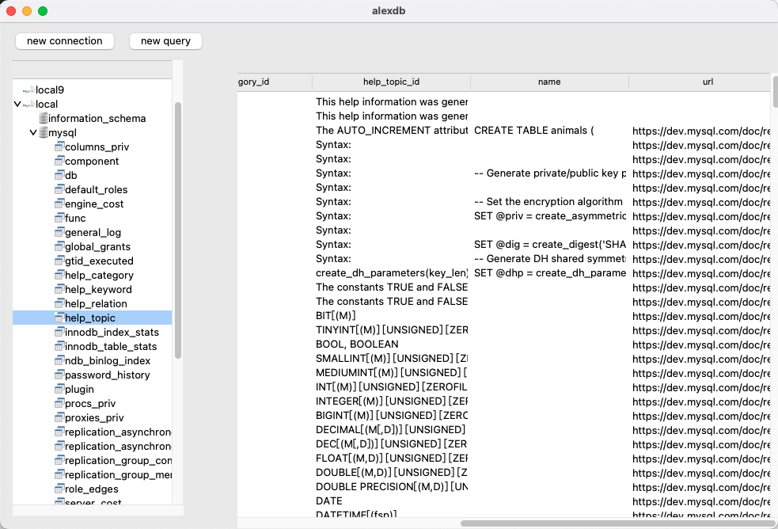

## alexDB

##### [Chinese](./README.CN.md)｜[English](./README.md)

[dev-log](./dev-log.md)

##### requirement

1. Python3.9+(include tcl/tk)
2. pymysql
3. PIL

##### example screenshot

##### About

Navicat is a very excellent database management tool, alexDB drawing on its very good design and operation mode, using pure ~~java openjfx~~ python,tkinter to develop a free, open source database management tool replacement
